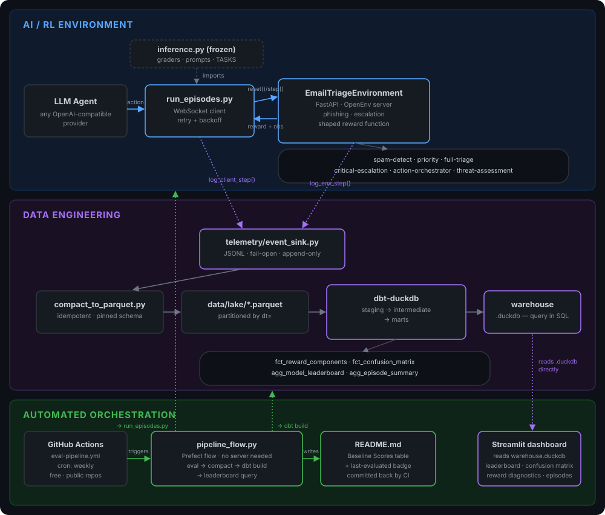

<div align="center">

# 📬 ATLAS - AI Telemetry & Learning Analytics Suite

### An RL environment where LLM agents learn to sort chaos — every decision logged, warehoused, and served up as a live leaderboard.

<p>
  
  
  
  
  
  
  
  <br/>
  <a href="https://emailrl-snpxvguw9b5sfwtvcdnjnp.streamlit.app/">
    
  </a>
</p>


<sub>↑ live-looping demo, built from a real run of this repo — not a mockup</sub>

</div>

---

ATLAS is a data engineering project at its core: a warehouse and
evaluation pipeline built around an LLM agent's decisions, not just a
place to log them. Most AI telemetry and observability tools — LangSmith,
Langfuse, Helicone, and similar — are built for live request tracing:
searching and inspecting individual production calls. ATLAS solves a
different problem: turning agent decisions into a structured, testable
evaluation dataset. Every decision is dbt-modeled through staging →
intermediate → mart layers, checked against a three-layer data quality
gate that validates the eval data itself, and rolled into a leaderboard
that a scheduled CI job regenerates automatically — no hand-updated
tables, no manually re-run notebooks. All of it runs on free, self-hosted,
open-source tooling (DuckDB, dbt, Parquet, Prefect), with no vendor
account required and no data ever leaving the repo.

## 🌐 Explore It

**→ Live dashboard:** [emailrl-snpxvguw9b5sfwtvcdnjnp.streamlit.app](https://emailrl-snpxvguw9b5sfwtvcdnjnp.streamlit.app/) —
no install, no API key. Leaderboard, confusion matrices, reward
diagnostics, data quality, and episode-level traces, all reading from the
warehouse produced by the latest scheduled run.

**→ Run it yourself:** clone the repo, bring your own OpenAI-compatible
LLM key (Groq's free tier works, no card required), and either walk
through the pipeline step by step or run the whole thing with one
command — see **⚙️ Getting Started** and **🚀 Application Lifecycle**
below.

---

## 🏗️ Architecture

Two halves, one pipeline: the **top half** is the RL environment itself —
an LLM agent making triage decisions against a reactive, adversarial
inbox. The **bottom half** is what turns every one of those decisions into
a queryable dataset — the part that makes this a data engineering project
as much as an AI one. The dashed arrows in the middle are the seam: two
telemetry hooks, one on each side of the WebSocket boundary, joined later
by `email_id`.

<p align="center">
  
</p>

### 🛡️ Data Quality Gate

Synthetic data pipelines fail quietly — a broken template, a sampling bug,
a generator regression — and the first sign is usually a training run
that just doesn't learn anything. This project catches that class of
problem at three layers, each cheaper and earlier than the last:

| Layer | What it checks | Where it runs |
|---|---|---|
| **1 — Source pool** | Structural (template placeholders, enum validity, category coverage) and statistical (500 sampled episodes: composition, cluster pairing, category balance, sender-domain signal) checks against the generator itself | `quality/validate_synthetic_emails.py`, standalone or in CI — no server, no LLM, no network |
| **2 — Runtime** | Invariant checks on every email actually served (route/category/priority consistency), logged as `email_quality_flags` alongside the reward it produced | Inside `EmailTriageEnvironment.step()`, fail-open |
| **3 — Warehouse** | The same invariants re-checked against the full collected dataset, plus schema-level tests | `dbt test`, against `stg_env_steps`/`stg_client_steps` |

Layer 1 is wired into CI (see the badge above) — a bad edit to the
template pool fails the build before it ever reaches an eval run.

### 🤖 Automated Evaluation Pipeline

The Baseline Scores table below is generated, not maintained by hand.
`orchestration/pipeline_flow.py` is a small [Prefect](https://www.prefect.io/)
flow — no Prefect server or daemon involved; it runs as a plain script,
the same way locally or in CI — that chains everything above into one call:

evaluate each model configured in `orchestration/model_config.yaml`
(`run_episodes.py`) → compact telemetry → `dbt build` (rebuilds every
mart *and* re-runs the Layer 3 data quality tests) → query
`agg_model_leaderboard` → rewrite this README's table → stamp a
"last evaluated" badge.

`.github/workflows/eval-pipeline.yml` runs it weekly on GitHub Actions'
free cron scheduling (public repos), and commits the regenerated README,
badge, and `warehouse.duckdb` straight back to the repo — which is also
what pushes a fresh redeploy of the live Streamlit dashboard above. The
table below reflects an actual scheduled run, not a snapshot from
whenever someone last remembered to update it by hand.

---

## 📊 Baseline Scores

<p>
  
</p>

<!-- BASELINE_SCORES_START -->
| Task | Model | N | Avg reward | Perfect-match | Priority acc. | Category acc. | Route acc. | Phishing catch |
|---|---|---|---|---|---|---|---|---|
| action-orchestrator | llama-3.1-8b-instant | 40 | 1.0% | 15.0% | 47.5% | 70.0% | 42.5% | 0.0% |
| critical-escalation | llama-3.1-8b-instant | 40 | 99.0% | 22.5% | 30.0% | 65.0% | 70.0% | 0.0% |
| full-triage | llama-3.1-8b-instant | 40 | 49.8% | 25.0% | 45.0% | 72.5% | 52.5% | 100.0% |
| priority-classification | llama-3.1-8b-instant | 40 | 57.3% | 32.5% | 57.5% | 62.5% | 55.0% | 0.0% |
| spam-detection | llama-3.1-8b-instant | 40 | 96.5% | 15.0% | 25.0% | 70.0% | 60.0% | 75.0% |
| threat-assessment | llama-3.1-8b-instant | 40 | 12.6% | 0.0% | 12.5% | 70.0% | 27.5% | 33.3% |

_Data quality violation rate across all logged steps: 0.0%._
<!-- BASELINE_SCORES_END -->

> Pulled directly from this repo's own collected `agg_model_leaderboard`
> data (only `llama-3.1-8b-instant`, all 6 tasks, evaluated so far). Add
> more entries to `orchestration/model_config.yaml` to grow this into a
> real multi-model comparison — no code changes needed, just config. The
> table between the two `BASELINE_SCORES` markers above is exactly what
> `orchestration/pipeline_flow.py` rewrites on every run; don't hand-edit
> between them, it'll just get overwritten. Want the fuller picture —
> confusion matrices, reward-shaping diagnostics, per-episode traces?
> That's the [live dashboard](https://emailrl-snpxvguw9b5sfwtvcdnjnp.streamlit.app/), not this table.

---

## ⚙️ Getting Started

### Prerequisites

| Requirement | Version |
|---|---|
| Python | 3.11+ |
| An OpenAI-compatible LLM endpoint | any — [Groq](https://console.groq.com) recommended, free tier, no card required |
| `dbt-duckdb` | installed via `requirements-warehouse.txt` |
| OS | Windows / macOS / Linux |

### Installation Guide

```bash
git clone https://github.com/Crunchygrunt/Email_RL.git
cd Email_RL

pip install -r server/requirements.txt
pip install -r requirements-warehouse.txt
pip install -r requirements-orchestration.txt   # only needed to run/regenerate the pipeline yourself
```

### Environment Configuration

Create a `.env` in the project root:

```bash
# .env.example — copy to .env and fill in your own key

API_BASE_URL=https://api.groq.com/openai/v1
MODEL_NAME=llama-3.3-70b-versatile OR llama-3.1-8b-instant
Grok API=your_api_key_here

EMAIL_RL_SERVER_URL=http://localhost:8000
```

## 🚀 Application Lifecycle

### Usage Instructions

Two ways to run this: by hand, one step at a time, or as a single
orchestrated command. Both need the environment server running first.

```bash
# 0 — validate the synthetic email generator (fast, no server needed)
python quality/validate_synthetic_emails.py

# 1 — start the environment server
uvicorn server.app:app --host 0.0.0.0 --port 8000
```

**Option A — manual, step by step** (in a second terminal, server from
step 1 already running):

```bash
# 2 — run a batch of graded episodes
python run_episodes.py --episodes 4

# 3 — compact raw telemetry into the Parquet lake
python telemetry/compact_to_parquet.py

# 4 — build the dbt warehouse
cd warehouse && dbt run --profiles-dir .

# 5 — run the data quality tests against the collected data
dbt test --profiles-dir .

# 6 — query your leaderboard
python -c "import duckdb; print(duckdb.connect('warehouse.duckdb').sql('select * from agg_model_leaderboard').df())"
```

**Option B — one command** (does exactly steps 2–5 above, for every model
in `orchestration/model_config.yaml`, then rewrites this README's
Baseline Scores table):

```bash
python orchestration/pipeline_flow.py
```

This is also exactly what runs on GitHub Actions' weekly schedule
(`.github/workflows/eval-pipeline.yml`) — no local terminal required for
that path at all; see 🤖 Automated Evaluation Pipeline above. Either way,
once `warehouse.duckdb` exists, you can browse the results without
re-running anything:

```bash
streamlit run dashboard/app.py
```

— or skip local setup entirely and use the
[live dashboard](https://emailrl-snpxvguw9b5sfwtvcdnjnp.streamlit.app/),
which stays in sync with the scheduled runs automatically.

### Core Features

- 🧠 **Six graded triage tasks** — spam detection, priority classification,
  full triage, critical escalation, action orchestration, and threat
  assessment, each with its own reward shaping and grading logic
- 🎭 **Adversarial email generation** — CEO-impersonation phishing,
  cross-email dependency clusters, and injected escalation follow-ups that
  react to the agent's own mistakes in real time
- 🔄 **Real multi-step episode continuity** — a WebSocket-driven harness
  that preserves streaks, dependencies, and coherence across a full
  10+-email episode, not just isolated single-shot calls
- 🧩 **Model-agnostic action parsing** — layered fallback (XML →
  `key: value` → loose text) so grading survives whatever format an LLM
  actually returns
- 📡 **Zero-dependency telemetry** — every environment step and every
  client decision streamed to append-only JSONL, fail-open by design
- 🏗️ **DuckDB + dbt warehouse** — staging → intermediate → mart layers,
  queryable with plain SQL, no server to run
- 🛡️ **3-layer data quality gate** — structural + statistical checks on
  the synthetic email generator (CI-enforced), runtime invariant flags on
  every served email, and dbt tests against the warehouse — catches
  generator regressions before they ever reach a training run
- 📊 **Multi-model leaderboard** — accuracy, perfect-match rate, and
  phishing catch rate, sliced by model and task
- 🤖 **Automated evaluation pipeline** — a Prefect flow, scheduled weekly
  via GitHub Actions, that regenerates the Baseline Scores table end to
  end: evaluate → compact → rebuild the warehouse → re-test → publish, no
  server and no manual leaderboard upkeep
- 📈 **Live, self-updating dashboard** — a Streamlit app reading the
  warehouse directly (leaderboard, confusion matrices, reward-component
  diagnostics, data quality, per-episode traces), redeployed automatically
  whenever the scheduled pipeline commits fresh data
- 🛡️ **Built-in resilience** — automatic retry/backoff on rate limits and
  dropped connections, so a long evaluation run survives the real world

### Tech Stack

<p>
  
  
  
  
  
  
  
  
  
  
</p>

| Layer | Tooling |
|---|---|
| RL environment | `OpenEnv`, `FastAPI`, custom reward shaping |
| Agent transport | `websockets`, async Python |
| LLM layer | Any OpenAI-compatible endpoint (Groq, OpenRouter, etc.) |
| Telemetry | Zero-dependency JSONL event sink |
| Storage | Apache Parquet, partitioned by date |
| Warehouse | DuckDB + `dbt-duckdb` |
| Data quality | Custom generator validator (Layer 1) + dbt tests (Layer 3) |
| Dashboard | Streamlit, reading the warehouse directly, hosted free on Streamlit Community Cloud |
| CI/CD | GitHub Actions |
| Orchestration | Prefect (flow/task orchestration, no server required) + GitHub Actions cron (free scheduling, public repos) |

---

## 🔮 Roadmap & Future Improvements

While this project currently implements a zero-dependency local lakehouse stack (JSONL → Parquet → DuckDB + dbt), the pipeline is designed to evolve into a full-scale enterprise observability and evaluation platform.

### 🛡️ 1. OpenTelemetry & OpenLLMetry Integration

* **Standardized Tracing:** Adopt OpenTelemetry (OTel) GenAI semantic conventions across the WebSocket transport to attach `Trace ID` and `Span ID` headers, providing distributed flame graphs across agent decision cycles.
* **Automated Operational Metrics:** Integrate `traceloop-sdk` (OpenLLMetry) to auto-instrument LLM client invocations, capturing prompt/completion token usage, API latency, and real-time cost estimation without manual logging.
* **Dual-Path Telemetry Architecture:** Route real-time traces to an OTel Collector for live APM monitoring (e.g., Langfuse, Jaeger, or Datadog) while maintaining bulk event streaming to Parquet/DuckDB for batch evaluation and leaderboards.

```
              ┌───────────────┐
              │ LLM Agent /   │
              │ Environment   │
              └───────┬───────┘
                      │
      ┌───────────────┴───────────────┐
      ▼                               ▼
(OpenLLMetry SDK)               (JSONL Event Hooks)
      │                               │
      ▼                               ▼
[ OTel Collector ]            [ Parquet Compaction ]
      │                               │
      ▼                               ▼
[ Real-time APM ]             [ DuckDB + dbt Warehouse ]
(Langfuse / Jaeger)           (Batch Leaderboards & Quality)
```

### ⚡ 2. Scale & Infrastructure Evolution

* **Streaming Engine Upgrade:** Replace local append-only JSONL event sinks with an **Apache Kafka** or **AWS SQS** message queue to handle high-throughput concurrent agent evaluation runs.
* **Cloud Warehouse Migration:** Port dbt models from DuckDB to **Snowflake** or **ClickHouse** to support multi-terabyte evaluation datasets and real-time analytical dashboards.
* **Orchestration & Containerization:** Package the complete environment server, database, and orchestration layer into Docker/Kubernetes manifests, so evaluation workers can scale horizontally instead of running one model at a time on a single GitHub Actions runner.

---

<div align="center">
<sub>Built on an OpenEnv hackathon submission, extended into a full observability stack.</sub>
</div>

