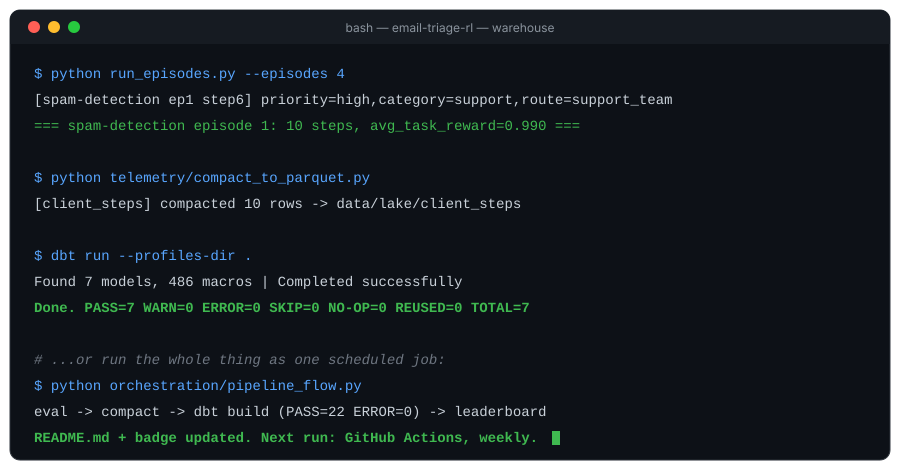

<div align="center">

# 📬 Email Triage Arena

### An RL environment where LLM agents learn to sort chaos — every decision logged, warehoused, and served up as a live leaderboard.

<p>
  
  
  
  
  
  
</p>



<sub>↑ live-looping demo, built from a real run of this repo — not a mockup</sub>

</div>

---

## ⚙️ Getting Started

### Prerequisites

| Requirement | Version |
|---|---|
| Python | 3.11+ |
| An OpenAI-compatible LLM endpoint | any — [Groq](https://console.groq.com) recommended, free tier, no card required |
| `dbt-duckdb` | installed via `requirements-warehouse.txt` |
| OS | Windows / macOS / Linux |

### Installation Guide

```bash
git clone https://github.com/<your-username>/email-triage-arena.git
cd email-triage-arena

pip install -r server/requirements.txt
pip install -r requirements-warehouse.txt
```

### Environment Configuration

Create a `.env` in the project root:

```bash
# .env.example — copy to .env and fill in your own key

API_BASE_URL=https://api.groq.com/openai/v1
MODEL_NAME=llama-3.3-70b-versatile
HF_TOKEN=your_api_key_here

EMAIL_RL_SERVER_URL=http://localhost:8000
```

> `HF_TOKEN` is just the name of the field — any OpenAI-compatible provider's
> key works here, it's not validated against a specific format.

---

## 🚀 Application Lifecycle

### Usage Instructions

```bash
# 1 — start the environment server
uvicorn server.app:app --host 0.0.0.0 --port 8000

# 2 — in a second terminal: run a batch of graded episodes
python run_episodes.py --episodes 4

# 3 — compact raw telemetry into the Parquet lake
python telemetry/compact_to_parquet.py

# 4 — build the dbt warehouse
cd warehouse && dbt run --profiles-dir .

# 5 — query your leaderboard
python -c "import duckdb; print(duckdb.connect('warehouse.duckdb').sql('select * from agg_model_leaderboard').df())"
```

### Core Features

- 🧠 **Six graded triage tasks** — spam detection, priority classification,
  full triage, critical escalation, action orchestration, and threat
  assessment, each with its own reward shaping and grading logic
- 🎭 **Adversarial email generation** — CEO-impersonation phishing,
  cross-email dependency clusters, and injected escalation follow-ups that
  react to the agent's own mistakes in real time
- 🔄 **Real multi-step episode continuity** — a WebSocket-driven harness
  that preserves streaks, dependencies, and coherence across a full
  10+-email episode, not just isolated single-shot calls
- 🧩 **Model-agnostic action parsing** — layered fallback (XML →
  `key: value` → loose text) so grading survives whatever format an LLM
  actually returns
- 📡 **Zero-dependency telemetry** — every environment step and every
  client decision streamed to append-only JSONL, fail-open by design
- 🏗️ **DuckDB + dbt warehouse** — staging → intermediate → mart layers,
  queryable with plain SQL, no server to run
- 📊 **Multi-model leaderboard** — accuracy, perfect-match rate, and
  phishing catch rate, sliced by model and task
- 🛡️ **Built-in resilience** — automatic retry/backoff on rate limits and
  dropped connections, so a long evaluation run survives the real world

### Tech Stack

<p>
  
  
  
  
  
  
  
</p>

| Layer | Tooling |
|---|---|
| RL environment | `OpenEnv`, `FastAPI`, custom reward shaping |
| Agent transport | `websockets`, async Python |
| LLM layer | Any OpenAI-compatible endpoint (Groq, OpenRouter, etc.) |
| Telemetry | Zero-dependency JSONL event sink |
| Storage | Apache Parquet, partitioned by date |
| Warehouse | DuckDB + `dbt-duckdb` |
| Orchestration | Plain Python CLI, no external scheduler required |

---

<div align="center">
<sub>Built on an OpenEnv hackathon submission, extended into a full observability stack.</sub>
</div>

